```mermaid
%%{init: {'theme':'base', 'themeVariables': { 'primaryColor':'#2D9EF7','primaryTextColor':'#fff','primaryBorderColor':'#1E88E5','lineColor':'#42A5F5','secondaryColor':'#64B5F6','tertiaryColor':'#90CAF9','background':'#0D1117','mainBkg':'#1E3A5F','secondBkg':'#2D9EF7','textColor':'#E1E4E8','fontSize':'16px'}}}%%
mindmap
  root((👨‍💻 Ridoy<br/>2025))
    🚀 Backend Mastery
      Go Programming
      System Design
      Microservices
      Performance Optimization
    💻 Full Stack Growth
      Next.js 15
      Server Components
      Edge Computing
      Real-time Apps
    🌟 Open Source
      Contributing
      Building in Public
      Community
      Collaboration
    📚 Learning
      Cloud Architecture
      DevOps Practices
      Design Patterns
```

<h1 align="center">
  
</h1>

<p align="center">
  <a href="https://nodeninja.netlify.app"></a>
  <a href="https://linkedin.com/in/dev-mehedi-hasan-ridoy"></a>
  <a href="https://discordapp.com/users/1068481777418649650"></a>
  <a href="mailto:devmehedihasan7@gmail.com"></a>
</p>

<div align="center">
  
</div>

---
<h2>
  <table align="left">
    <tr>
      <td></td>
      <td><span style="font-size: 24px;">About Me</span></td>
    </tr>
  </table>
</h2>
 <br clear="left"/>


```javascript
const ridoy = {
  pronouns: "He/Him",
  location: "Dhaka, Bangladesh 🇧🇩",
  education: "BSc in Physics 🔬",
  role: "Backend-Focused Full Stack Developer",
  
  passions: [
    "Building scalable backend architectures",
    "Crafting efficient APIs",
    "Solving complex problems with code"
  ],
  
  superpower: "Physics logic + Clean code = 🔥",
  
  currentlyWorking: "Digital Diagnostics System",
  currentlyLearning: ["Go", "System Design", "Microservices"],
  
  availableFor: ["Freelance", "Full-time", "Collaboration"],
  
  funFact: "I debug code like solving physics equations!"
};
```

---
 <h1>
  <table align="left">
    <tr>
      <td></td>
      <td><span style="font-size: 24px;">Tech Stack & Tools</span></td>
    </tr>
  </table>
  </h1> 
  <br clear="left"/>
<div align="center">

<table>
<tr>
<td align="center" width="50%">

####  Backend & Server

<p align="center">
  <a href="https://nodejs.org">
    
  </a>
  <a href="https://expressjs.com">
    
  </a>
  <a href="https://nestjs.com">
    
  </a>
  <a href="https://www.typescriptlang.org">
    
  </a>
  <a href="https://www.prisma.io">
    
  </a>
</p>

```yaml
Expertise:
  - RESTful API Design
  - GraphQL Implementation
  - Microservices Architecture
  - Authentication & Authorization
```

</td>
<td align="center" width="50%">

####  Database & Caching

<p align="center">
  <a href="https://www.postgresql.org">
    
  </a>
  <a href="https://www.mongodb.com">
    
  </a>
  <a href="https://redis.io">
    
  </a>
  <a href="https://www.prisma.io">
    
  </a>
</p>

```yaml
Expertise:
  - Database Schema Design
  - Query Optimization
  - Data Modeling
  - Caching Strategies
```

</td>
</tr>

<tr>
<td align="center" width="50%">

####  Frontend & UI

<p align="center">
  <a href="https://react.dev">
    
  </a>
  <a href="https://nextjs.org">
    
  </a>
  <a href="https://redux.js.org">
    
  </a>
  <a href="https://tailwindcss.com">
    
  </a>
  <a href="https://developer.mozilla.org/en-US/docs/Web/JavaScript">
    
  </a>
</p>

```yaml
Expertise:
  - Component Architecture
  - State Management
  - Responsive Design
  - Modern UI/UX Patterns
```

</td>
<td align="center" width="50%">

####  DevOps & Tools

<p align="center">
  <a href="https://www.docker.com">
    
  </a>
  <a href="https://git-scm.com">
    
  </a>
  <a href="https://github.com">
    
  </a>
  <a href="https://firebase.google.com">
    
  </a>
  <a href="https://www.postman.com">
    
  </a>
</p>

```yaml
Expertise:
  - Containerization
  - CI/CD Pipelines
  - Version Control
  - API Testing
```

</td>
</tr>

<tr>
<td colspan="2" align="center">

####  Currently Learning & Exploring

<p align="center">
  <a href="https://go.dev">
    
  </a>
  <a href="https://kubernetes.io">
    
  </a>
</p>

```yaml
Focus Areas:
  - Go Programming & Concurrency
  - Container Orchestration
  - System Design Patterns
  - Cloud Native Architecture
```

</td>
</tr>
</table>

</div>

---

<h2>
  <table align="left">
    <tr>
      <td></td>
      <td><span style="font-size: 24px;">Featured Projects</span></td>
    </tr>
  </table>
</h2>
<br clear="left"/>

<div align="center">

<table>
<tr>
<td width="50%">

###  Digital Wallet System
[](https://github.com/nodeNINJAr/Digital-Wallet-System-frontend/tree/development)
[](https://degital-wallet.netlify.app/)

Modern digital wallet with real-time transactions

**Built with:**
- React 19 + TypeScript
- Redux Toolkit + RTK Query
- TailwindCSS + Framer Motion
- React Hook Form + Zod
- Radix UI + Lucide Icons

</td>
<td width="50%">

###  Nexus Tech
[](https://github.com/nodeNINJAr/nexus-tech-client)
[](https://nexustech-b3673.web.app)

Enterprise HR & employee management platform

**Built with:**
- React + Express.js
- MongoDB + Firebase
- Material UI

</td>
</tr>

<tr>
<td width="50%">

###  SayEasy
[](https://github.com/nodeNINJAr/sayEasy-client)
[](https://sayeasy-95352.web.app)

Global language tutoring marketplace

**Built with:**
- React + Express.js
- MongoDB + Firebase
- Real-time booking system

</td>
<td width="50%">

###  Digital Diagnostics
[](https://github.com/nodeNINJAr)

Comprehensive patient & diagnostic management

**Built with:**
- Node.js + TypeScript
- PostgreSQL + Prisma
- Next.js + TailwindCSS

</td>
</tr>
</table>

</div>

---

<h2>
  <table align="left">
    <tr>
      <td></td>
      <td><span style="font-size: 24px;">GitHub Statistics</span></td>
    </tr>
  </table>
</h2>
<br clear="left"/>

<div align="center">
  
  
</div>

<div align="center">
  
</div>

<div align="center">
  
</div>

---

<h2>
  <table align="left">
    <tr>
      <td></td>
      <td><span style="font-size: 24px;">Contribution Graph</span></td>
    </tr>
  </table>
</h2>
<br clear="left"/>

<div align="center">
  
</div>

---

<h2>
  <table align="left">
    <tr>
      <td></td>
      <td><span style="font-size: 24px;">What I Bring to the Table</span></td>
    </tr>
  </table>
</h2>
<br clear="left"/>

<div align="center">

|  Backend Architecture |  Database Design |  API Development |
|:---:|:---:|:---:|
| Scalable microservices | Optimized schemas | RESTful & GraphQL |
| ** Authentication** | ** Containerization** | ** Modern UI/UX** |
| JWT, OAuth, Sessions | Docker deployments | React ecosystems |

</div>

---

<h2>
  <table align="left">
    <tr>
      <td></td>
      <td><span style="font-size: 24px;">Current Focus</span></td>
    </tr>
  </table>
</h2>
<br clear="left"/>

<div align="center">



</div>

---

<h2>
  <table align="left">
    <tr>
      <td></td>
      <td><span style="font-size: 24px;">Quick Facts</span></td>
    </tr>
  </table>
</h2>
<br clear="left"/>

<p>
 Physics grad who fell in love with code<br>
 Backend enthusiast with full-stack capabilities<br>
 Love architecting scalable systems<br>
 Coffee-powered developer<br>
 Open to exciting opportunities
</p>  

---

<h2 align="center">
  <table align="center">
    <tr>
      <td></td>
      <td><span style="font-size: 24px;">Let's Connect & Collaborate!</span></td>
    </tr>
  </table>
</h2>

<div align="center">

I'm always excited to work on interesting projects and connect with fellow developers!

[](https://nodeninja.netlify.app)
[](https://linkedin.com/in/dev-mehedi-hasan-ridoy)
[](mailto:devmehedihasan7@gmail.com)
[](https://discordapp.com/users/1068481777418649650)

<h3 align="center">
  <table align="center">
    <tr>
      <td></td>
      <td><span style="font-size: 20px;">Available For</span></td>
    </tr>
  </table>
</h3>

✅ **Freelance Projects** • ✅ **Full-time Roles** • ✅ **Open Source** • ✅ **Mentorship** • ✅ **Tech Talks**


</div>

---

<div align="center">

<h3 align="center">
  <table align="center">
    <tr>
      <td></td>
      <td><span style="font-size: 20px;">Words I Live By</span></td>
    </tr>
  </table>
</h3>

> *"The best way to predict the future is to create it."* — Peter Drucker


**⭐ From [nodeNINJAr](https://github.com/nodeNINJAr) • Made with ❤️ and lots of ☕**

</div>
